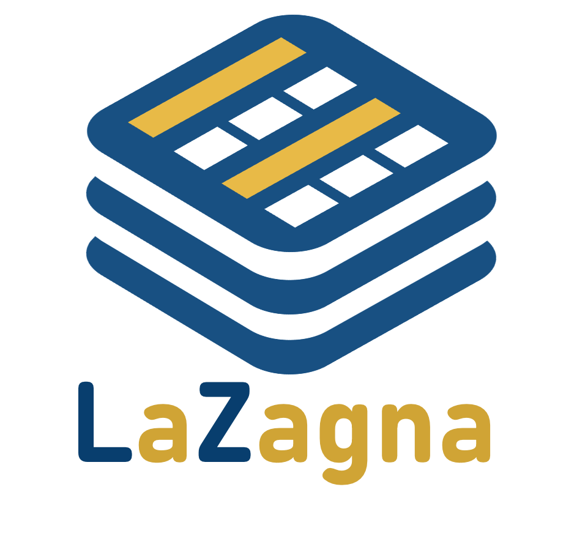

.. LaZagna documentation master file

LaZagna Documentation
=====================

**LaZagna** is an open-source tool for designing and evaluating **3D FPGA architectures**.
It supports customizable vertical interconnects, layer heterogeneity, and switch block patterns.
LaZagna generates synthesizable RTL and bitstreams, enabling full architectural exploration
from high-level specs to physical design.

.. note::

   LaZagna is under active development. New features and documentation are being added regularly.

.. toctree::
   :maxdepth: 2
   :caption: About LaZagna

   source/about

Getting Started
---------------

.. toctree::
   :maxdepth: 2
   :caption: User Guide

   source/installation
   source/usage
   source/yaml_configuration

.. .. toctree::
..    :maxdepth: 2
..    :caption: API Reference

..    source/modules

.. .. toctree::
..    :maxdepth: 1
..    :caption: Project

..    source/contributing

